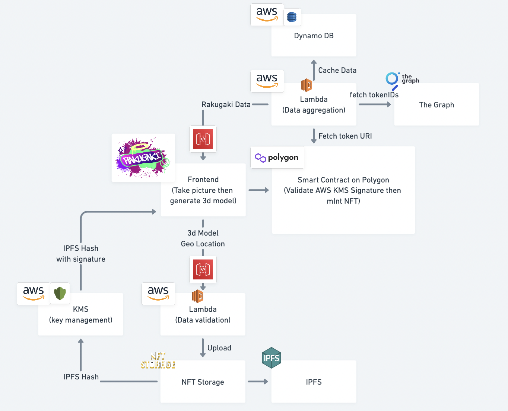

# Rakugaki

this readme focus on tech side

## Submission

https://devpost.com/software/rakugaki-y752l9

## Architecture



## NFT

Using NFT to make timestamp and provenanve

- NFT

  - https://mumbai.polygonscan.com/address/0x9D31bcdf2e4CC9C33586224526b15D6ECF242D61

- Data Aggregator

  - https://mumbai.polygonscan.com/address/0x9D31bcdf2e4CC9C33586224526b15D6ECF242D61#code

## IPFS

Using IPFS as file storage to preserve better way.

- https://github.com/HackerSamuraiDAO/2022-Polygon-BUIDL-IT-submission/blob/main/packages/frontend/src/lib/ipfs/index.ts#L22

## AWS

- function is deployed at lambda, it is doing data aggregation

  - https://github.com/HackerSamuraiDAO/2022-Polygon-BUIDL-IT-submission/blob/main/packages/functions/src/functions/get.ts#L24

- data validation by KMS Sign and content validation is not implemented

## Tested Environment

- Devices

  - Chrome on Mac OS
  - Metamask Mobile on iOS

- Disclaimer
  - Other devices are not tested, please use above devices if possible.
  - Please turn on the location tracking

## Development

### Frontend

```
cd packages/frontend
yarn
yarn dev
```

### Contracts

```
cd packages/contracts
yarn
yarn test
yarn build // this is used in frontend package
```

### Functions

```
cd packages/functions
yarn
yarn dev
yarn build // this generates zip file to deploy AWS lambda
```
